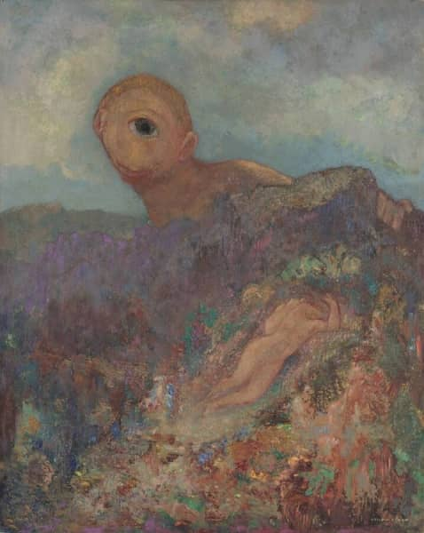

**Description du projet**
{: .text-delta .fs-4 .label .label-purple_200 }

Suite à une recherche de Master 1 consacrée aux mises en scène contemporaines des comédies d'Aristophane sur les scènes française et hellénophones,
cette année notre recherche porte sur la réception contemporaine du drame satyrique.
Comme le corpus de cette recherche consiste avant tout en des mises en scène, objet complexe en tant que donnée,
il est important d'accompagner le mémoire d'une exposition d'éléments relatifs à ces mises en scène
(photos, extraits vidéo, etc.).
A cet égard, le cours de Master 2 intitulé "Humanités Numériques 4" nous a servi pour créer
cette exposition virtuelle d'éléments des mises en scène en question.

**Les trois spectacles du corpus**
{: .text-delta .fs-4 .label .label-purple_200 }

  Euripide, [*Le Cyclope*](https://www.ntng.gr/default.aspx?lang=en-GB&page=2&production=5584), mise en scène de Yiannis Rigas, Théâtre National de la Grèce du Nord (NTNG), 2001\
  Euripide, [*Le Cyclope*](http://aefestival.gr/festival_events/pantelis-dentakis-2017/?lang=en), mise en scène de Pantelis Dentakis, Festival d'Athènes et d'Epidaure, 2017\
  Euripide, [*Le Cyclope*](https://lecube.labellemeuniere.fr/en/residences/le-cyclope), mise en scène de Christian Esnay, Le Cube, 2018

  \
  Odilon Redon, *Le Cyclope*, 1914. Source : [Musée Kröller-Müller](https://krollermuller.nl/en/odilon-redon-the-cyclops-1)
