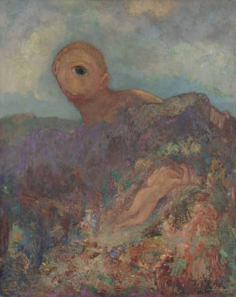

Drame satyrique
{: .text-delta .fs-8 .label .label-red }

Maria Constantinou\
Master 2 Humanités classiques et humanités numériques\
Université Paris-Nanterre\
2021-2022

**Matériel autour du mémoire de recherche\
*Drame satyrique : une théâtralité fragmentaire à faire revivre
Présence(s) et continuation(s) du chœur satyrique sur la scène contemporaine***

\
Odilon Redon, *Le Cyclope*, 1914. Source : [Musée Kröller-Müller](https://krollermuller.nl/en/odilon-redon-the-cyclops-1)

*Ce site a été crée à des fins académiques, comme annexe au mémoire de recherche préparé en janvier-juin 2022. Le matériel exposé ici est disponible sur le web, et je n'en dispose pas des droits.*

{: .pt-8 .pb-8}

[Descrption du projet](docs/description.md){: .btn .mr-4}
