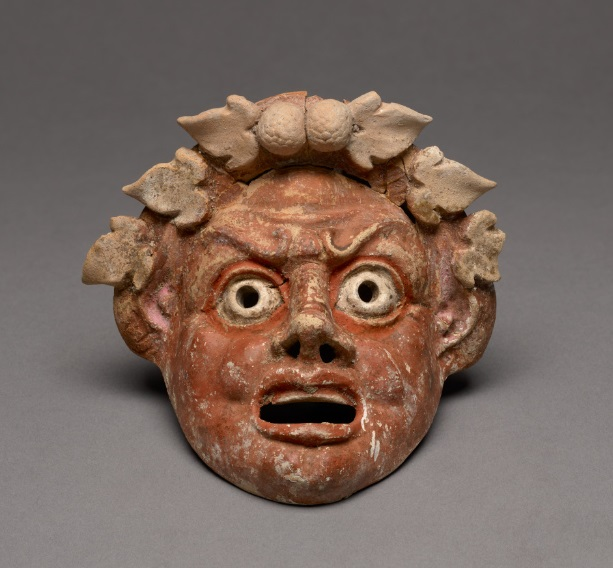

Drame satyrique
{: fs-8 .text-delta .fs-4 .label  .label-green }

Maria Constantinou\
Master 2 Humanités classiques et humanités numériques\
Université Paris-Nanterre\
2021-2022
{: .text-delta .fs-4 }

**Drame satyrique : une théâtralité fragmentaire à faire revivre\
Présence(s) et continuation(s) du chœur satyrique sur la scène contemporaine**
{: .fs-6 	.text-green-200 .flex-justify-middle }

*Bienvenue* !\
Ce site, crée dans le cadre du cours "Humanités Numériques 4", vise à rassembler des données relatives à ce mémoire de recherche. Il s'agit pour les visiteurs d'avoir un aperçu des mises en scène qui constituent le corpus de cette recherche.

<!-- image en HTML -->

<figure role="figure" aria-label="Masque de satyre, Musée Getty">
   
   <figcaption>
    Masque de satyre, Musée Getty
   </figcaption>
</figure>

<!--image en MD

Masque de satyre, [Musée Getty](https://www.getty.edu/art/collection/objects/32043/unknown-maker-mask-of-a-satyr-greek-sicilian-200-100-bc/)
{: .fs-3 }
-->

*Les matériaux temporairement exposés ici sont librement accessibles sur le Web. Je ne dispose pas de tous les droits de reproduction et de diffusion qui seraient nécessaires à leur publication.*
{: .fs-2 }
